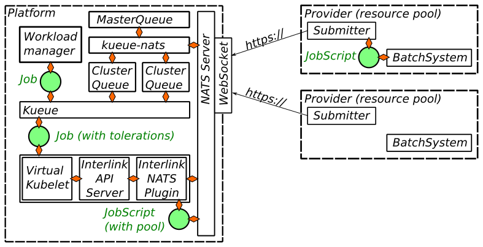

# Architecture

As you may probably guess, the InterLink NATS Plugin is a *plugin* for 
[InterLink](https://intertwin-eu.github.io/interLink/), 
a [Virtual Kubelet](https://virtual-kubelet.io/) provider designed to execute 
Kubernetes pods in batch-job providers.

The InterLink NATS Plugin is built on two core ideas:
 * a NATS overlay, accessed via TLS-terminated WebSockets, enable a bidirectional communication between the login- 
   or edge-nodes of the resource providers without the need for network ingress rules. 
 * the job is converted into a bash script with the same Python code for all execution backends; the job script is 
   sent by the plugin via NATS and submitted by a thin script to one of the queues; this approach reduces the 
   duplication of the logics translating a Kubernetes pod in a bash script (which comes with a price in terms of 
   supported features).

To manage the submission of payloads to multiple sites, possibly with different prices, features and limitations,
the InterLink NATS plugin relies on Kueue. A simple operator, named `kueue-nats`, takes care of mapping the resource
providers into Kueue [ResourceFlavors](https://kueue.sigs.k8s.io/docs/concepts/resource_flavor/) and 
[ClusterQueues](https://kueue.sigs.k8s.io/docs/concepts/cluster_queue/) following the directives defined in a 
custom resource named `MasterQueue` and the available resource as published via NATS from the submitters. 

A schematic representation of the architecture is presented below.

## The lifecycle of a job
To ease understanding the steps entering the submission and the execution of a Job, let's consider an example 
job and let's discuss the steps of its admission and submission.

1. **Job creation.** A `batch/V1Job` resource is created by some *Workload manager* or by `kubectl`. 
   It should include the Kueue-specific annotations defining the target `LocalQueue` and, if intended for
   offloading, it must feature the standard InterLink toleration for the taint 
   `virtual-node.interlink/no-schedule=true:NoSchedule`.
2. **Job admission.** When the `ClusterQueue` the job has been submitted to has sufficient resources it admits the 
   workload, assigning the highest-priority, compatible `ResourceFlavor`. 
   Kueue defines the resource pool to which the payload is destined with the toleration `pool.vk.io`. It will be 
   responsibility of the plugin to submit the payload with the correct NATS subject to make the submitters of the 
   right pool to receive and process it.
   Note that a `ClusterQueue` can include both
   local and interlink-related flavors, so a job tolerating offloading can be executed locally if the remote providers
   are either not available or completely committed or their corresponding `ResourceFlavors` are defined in the 
   ClusterQueue logic at lower priority. Clearly, jobs not tolerating offloading will be mapped on local
   `ResourceFlavors` only.
3. **Job transmission.** Once the Job is assigned to a *VirtualKubelet*, it is propagated to the InterLink API server
   and then to the InterLink NATS Plugin. In Helm chart made available in this repository, the three components are run
   in three containers of the same pod and communicate through a loopback network interface. Other architectures 
   splitting the containers in different Pods, or even cluster, with OAuth2-proxy for authentication have been tested 
   successfully, but they are too complex for being centrally maintained.
4. **Job translation.** Once the job reaches the plugin, it gets translated into a bash script. Note that the target 
   pool is known at conversion time, and the generation of the script can be tweaked via a `BuildConfig` that the 
   submitter publish periodically via NATS. This enables defining custom caches or singularity flags.
5. **Job request.** The Job is sent to the submitter through a NATS request, using a subject including the pod name.
6. **Job submission.** Finally, the job received by the *backend-specific submitter* which submits it to the actual
   backend.

